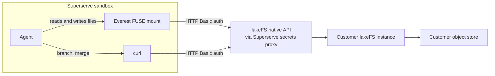

[lakeFS](https://lakefs.io/) provides Git-like branches, commits, and merges
for data stored in an object store. Mount a repository (or a ref and prefix
within one) as a filesystem so agents can read and write it with ordinary
file tools, then commit or merge through lakeFS's REST API.



With `--presign=false` (see step 3), both metadata and object data flow
through the lakeFS server, so everything leaving the sandbox passes through
Superserve's secrets proxy.

lakeFS is bring-your-own: you provide the instance, repository, and access
policy. Superserve does not provision or operate lakeFS.

<Note>
Everest is proprietary software that requires **lakeFS Cloud or Enterprise**.
Obtain the binary, or an authorized download URL for it, from lakeFS. The
entitlement is a property of the lakeFS deployment you mount against, not of
the credentials you authenticate with — Everest checks it against the server
at mount time.
</Note>

## 1. Add Everest to a template

Fetch Everest from the download URL lakeFS gave you and verify it against the
checksum they published for that artifact — pin both rather than trusting the
download:

<CodeGroup>
```typescript TypeScript
import { Template } from "@superserve/sdk"

// Supplied by you, from lakeFS -- not distributed with this guide.
const everestUrl = process.env.EVEREST_DOWNLOAD_URL!
const everestSha256 = process.env.EVEREST_SHA256!

const template = await Template.create({
  name: "lakefs-everest-base",
  from: "ubuntu:24.04",
  steps: [
    {
      run: "apt-get update && apt-get install -y ca-certificates curl python3 util-linux fuse3",
    },
    {
      run:
        `curl -sL -o /tmp/everest.tar.gz ${everestUrl} && ` +
        `echo '${everestSha256}  /tmp/everest.tar.gz' | sha256sum -c - && ` +
        "tar xzf /tmp/everest.tar.gz -C /usr/local/bin everest && chmod +x /usr/local/bin/everest",
    },
  ],
})

await template.waitUntilReady()
```

```python Python
import os
from superserve import Template, RunStep

# Supplied by you, from lakeFS -- not distributed with this guide.
everest_url = os.environ["EVEREST_DOWNLOAD_URL"]
everest_sha256 = os.environ["EVEREST_SHA256"]

template = Template.create(
    name="lakefs-everest-base",
    from_="ubuntu:24.04",
    steps=[
        RunStep(
            run="apt-get update && apt-get install -y ca-certificates curl python3 util-linux fuse3"
        ),
        RunStep(
            run=f"curl -sL -o /tmp/everest.tar.gz {everest_url} && "
            f"echo '{everest_sha256}  /tmp/everest.tar.gz' | sha256sum -c - && "
            "tar xzf /tmp/everest.tar.gz -C /usr/local/bin everest && chmod +x /usr/local/bin/everest"
        ),
    ],
)

template.wait_until_ready()
```
</CodeGroup>

Superserve templates run Linux x86_64, so use that build of Everest.

## 2. Store the lakeFS credential

Everest's own lakeFS API calls use plain HTTP Basic auth (confirmed against a
real lakeFS instance), the same as the branch/merge calls Superserve's
example makes directly. That means **one Superserve Secret covers both** —
unlike some BYO integrations, the real secret access key never has to enter
the sandbox at all, for the mount or for the API calls:

<CodeGroup>
```typescript TypeScript
import { Secret } from "@superserve/sdk"

const endpoint = process.env.LAKEFS_ENDPOINT!

await Secret.create({
  name: "lakefs-secret",
  value: process.env.LAKEFS_SECRET_ACCESS_KEY!,
  hosts: [new URL(endpoint).hostname],
  auth: { type: "basic" },
})
```

```python Python
import os
from urllib.parse import urlparse
from superserve import Secret

endpoint = os.environ["LAKEFS_ENDPOINT"]

Secret.create(
    name="lakefs-secret",
    value=os.environ["LAKEFS_SECRET_ACCESS_KEY"],
    hosts=[urlparse(endpoint).hostname],
    auth={"type": "basic"},
)
```
</CodeGroup>

## 3. Mount the repository

Bind the same secret under both the generic env var (used for branch/merge
calls) and Everest's own credential env vars, then mount:

<CodeGroup>
```typescript TypeScript
import { Sandbox } from "@superserve/sdk"

const sandbox = await Sandbox.create({
  name: "lakefs-worker",
  fromTemplate: "lakefs-everest-base",
  envVars: {
    LAKEFS_ENDPOINT: process.env.LAKEFS_ENDPOINT!,
    LAKEFS_ACCESS_KEY_ID: process.env.LAKEFS_ACCESS_KEY_ID!,
    EVEREST_LAKEFS_SERVER_ENDPOINT_URL: process.env.LAKEFS_ENDPOINT!,
    EVEREST_LAKEFS_CREDENTIALS_ACCESS_KEY_ID: process.env.LAKEFS_ACCESS_KEY_ID!,
  },
  secrets: {
    LAKEFS_API_SECRET_ACCESS_KEY: "lakefs-secret",
    EVEREST_LAKEFS_CREDENTIALS_SECRET_ACCESS_KEY: "lakefs-secret",
  },
})

await sandbox.commands.run("mkdir -p /mnt/lakefs")
await sandbox.commands.run(
  "everest mount lakefs://my-repository/main/ /mnt/lakefs --protocol fuse --k2=false --presign=false",
)

const files = await sandbox.commands.run("find /mnt/lakefs -maxdepth 2 -type f")
console.log(files.stdout)
```

```python Python
import os
from superserve import Sandbox

sandbox = Sandbox.create(
    name="lakefs-worker",
    from_template="lakefs-everest-base",
    env_vars={
        "LAKEFS_ENDPOINT": os.environ["LAKEFS_ENDPOINT"],
        "LAKEFS_ACCESS_KEY_ID": os.environ["LAKEFS_ACCESS_KEY_ID"],
        "EVEREST_LAKEFS_SERVER_ENDPOINT_URL": os.environ["LAKEFS_ENDPOINT"],
        "EVEREST_LAKEFS_CREDENTIALS_ACCESS_KEY_ID": os.environ["LAKEFS_ACCESS_KEY_ID"],
    },
    secrets={
        "LAKEFS_API_SECRET_ACCESS_KEY": "lakefs-secret",
        "EVEREST_LAKEFS_CREDENTIALS_SECRET_ACCESS_KEY": "lakefs-secret",
    },
)

sandbox.commands.run("mkdir -p /mnt/lakefs")
sandbox.commands.run(
    "everest mount lakefs://my-repository/main/ /mnt/lakefs --protocol fuse --k2=false --presign=false"
)

files = sandbox.commands.run("find /mnt/lakefs -maxdepth 2 -type f")
print(files.stdout)
```
</CodeGroup>

<Warning>
**`--k2=false`** disables Everest's default "K2" caching layer. Confirmed
against a real instance: with K2 enabled, remounting the same ref on the same
sandbox shortly after a commit landed elsewhere can silently serve a stale
read — even a direct file lookup, not just a directory listing — despite the
mount reporting the correct, up-to-date commit ID. Pass it unless you've
independently verified your workload never remounts a ref that might have
changed underneath it.

**`--presign=false`** routes object data through the lakeFS server instead of
presigned URLs straight to the object store. Without it, `everest commit`
currently fails in a sandbox that has secrets bound: the egress proxy rebuilds
outbound requests without a `Content-Length`, so the upload is framed as
`Transfer-Encoding: chunked`, which S3 rejects with `501 NotImplemented`.
Presigned transfers are faster, so drop this flag once that's fixed.
</Warning>

Mounts are read-only by default; use a commit ID as the ref for reproducible
reads. A locked-down sandbox needs HTTPS egress to your lakeFS endpoint — with
`--presign=false` all metadata *and* object data flow through it, so the
object store doesn't need its own egress rule. If you later switch presigned
transfers back on, allow the object-store hosts too.

## Choosing a credential scope

lakeFS RBAC lets you scope an identity by repository, branch prefix, and
action (read/list vs. write/commit), attached to a dedicated user rather than
your admin account. There's no single right scope for every setup — think
about it along a few axes and pick what fits:

- **Team-wide vs. per-user vs. per-sandbox vs. per-agent**: one shared
  identity is simplest to operate; a dedicated identity per agent gives the
  clearest audit trail and the smallest blast radius on revocation, at the
  cost of more credentials to manage.
- **Repository- or prefix-scoped**: restrict a policy to one repository (or a
  path prefix within it) so a leaked credential can't reach unrelated data.
- **Read-only vs. read/write**: this guide uses one read/write identity for
  simplicity. In production, consider separate reader and writer identities
  so read-heavy workloads can't accidentally write, and vice versa.
- **One branch per write-capable agent**: gives each agent an isolated
  workspace and keeps merges explicit and reviewable, rather than several
  agents racing to write the same branch.

Sharing one credential across multiple sandboxes is fine for a shared
read-only dataset. For write access, prefer one branch (and ideally one
scoped identity) per agent — see the [multi-agent
example](#multiple-agents-on-one-dataset) below.

## Write and commit

Writable mounts target a branch that must already exist (create it via the
REST API first) and add `--write-mode`. Writes stage to Everest's own
internal temporary branch, confirmed to auto-merge into the target branch and
auto-delete itself when `everest commit` succeeds:

```typescript TypeScript
await sandbox.commands.run(
  "everest mount lakefs://my-repository/agent-1/ /mnt/lakefs --protocol fuse --k2=false --presign=false --write-mode",
)
await sandbox.files.write("/mnt/lakefs/results/agent-1.json", '{"ok":true}\n')
await sandbox.commands.run('everest commit /mnt/lakefs -m "Add agent 1 results"')
```

Give each write-capable sandbox its own branch and output path to avoid merge
conflicts, and merge explicitly through the lakeFS REST API once every agent
has committed.

## Multiple agents on one dataset

lakeFS's headline feature is exactly this: several agents, each in its own
Superserve sandbox, working on branches of the same underlying dataset at
once. The [multi-agent
example](https://github.com/superserve-ai/superserve/tree/main/examples/lakefs)
creates one branch and sandbox per agent, partitions a shared input dataset
across them (so agents don't step on each other's files), has each agent
commit its own results, merges every branch back into the base ref, and then
**verifies the merge** by mounting the base ref read-only from a fresh mount
and checking every agent's output landed — worth doing before you trust a
merge in your own pipeline, not just in the demo. This is exactly the pattern
`--k2=false` above protects: without it, that verification mount can report
a false negative.

The same example can pause and resume one agent's sandbox mid-run and
re-verify the mount afterward — Superserve's sandbox pause/resume checkpoints
the whole VM (including the live FUSE mount), so a long-running agent job can
be suspended cheaply without losing its place. See [Sandbox
lifecycle](/sandbox/lifecycle) for how pause/resume works in general.

## Unmount and cleanup

Unmount before intentionally killing a sandbox so Everest can finish cleanly:

```typescript TypeScript
await sandbox.commands.run("everest umount /mnt/lakefs")
await sandbox.kill()
```

Committed lakeFS data and branches are **not** cleaned up automatically, by
design — lakeFS is the system of record and Superserve compute is
disposable. Uncommitted changes in a killed sandbox's mount are lost;
branches and commits you did create remain in lakeFS until you delete them
yourself.

## How it complements pause and resume

[Pause and resume](/sandbox/lifecycle) checkpoint one sandbox's full VM state:
memory, processes, and local disk — including the FUSE mount and the Everest
process backing it, so an agent can be suspended mid-task and pick up on the
same mount when it resumes. lakeFS checkpoints the other half: a commit is a
durable, named point in the *data* that outlives the sandbox entirely and that
other sandboxes can mount.

The two solve different problems, and the distinction matters when a run goes
wrong. Pausing preserves work-in-progress cheaply, but it's still
work-in-progress: uncommitted changes live only inside that one sandbox, and a
`kill()` — or a failure you can't resume from — takes them with it. Committing
is what makes results durable and shareable. So pause when an agent needs to
stop and continue later; commit when it reaches a result worth keeping,
handing to another agent, or rolling back to.

<Tip>
For long-running agents, commit at meaningful checkpoints rather than only at
the end. Each commit is a point you can branch from, diff against, or restore,
and it bounds how much work a failed sandbox can cost you.
</Tip>

## Tips

- **Allowlist the object store if you turn presigned transfers back on.** With `--presign=false` everything goes through the lakeFS host, so that one [egress](/sandbox/networking) rule is enough. Drop the flag and Everest pulls and pushes file data over presigned URLs pointing at the object store instead — a sandbox allowing only the lakeFS host will then mount and list fine, and fail on the first real read.
- **Scope credentials per agent for write workloads.** A dedicated lakeFS identity per agent gives you a clean audit trail and the smallest blast radius on revocation. Pair it with one branch per agent so merges stay explicit — see [Choosing a credential scope](#choosing-a-credential-scope).
- **Mount a commit ID, not a branch, for reproducible reads.** A branch ref moves as others commit to it; a commit ID pins the exact dataset a run saw, which matters when you need to re-run an agent against identical inputs.
- **Pass `--k2=false`.** Everest's default caching can serve a stale read after remounting a ref that changed elsewhere, while still reporting the correct commit ID. If your workload ever remounts a ref mid-run — the verification step in the multi-agent example does — leave this off.
- **Unmount before you kill the sandbox.** `everest umount` lets Everest finish its own cleanup. Committed data is already safe in lakeFS, but uncommitted changes in the mount are lost either way, so commit first if you meant to keep them.
- **Build the binary into a template, not into each sandbox.** [Templates](/templates/overview) snapshot the install, so every sandbox starts mount-ready instead of re-fetching Everest on each run.

## Related

- [Superserve Secrets](/secrets/overview)
- [Sandbox networking](/sandbox/networking)
- [Sandbox lifecycle](/sandbox/lifecycle)
- [Templates](/templates/overview)
- [lakeFS Mount (Everest) releases](https://docs.lakefs.io/releases/everest/)
- [lakeFS Mount (Everest) reference](https://docs.lakefs.io/mount/)
